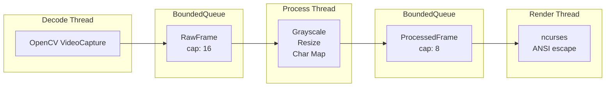
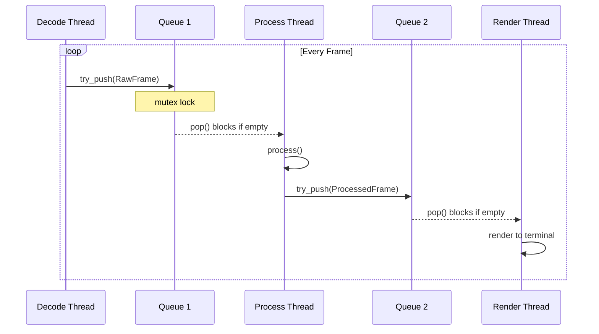
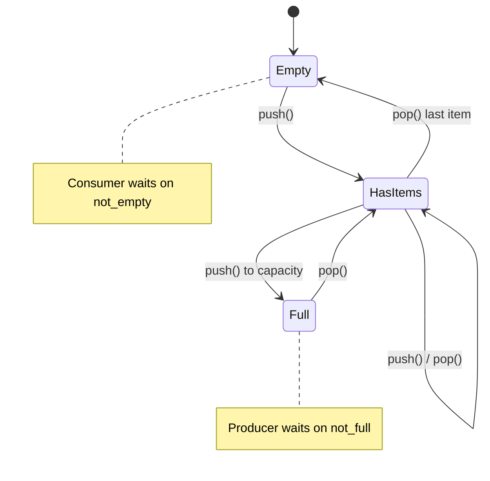
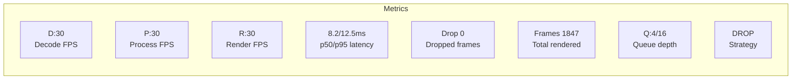
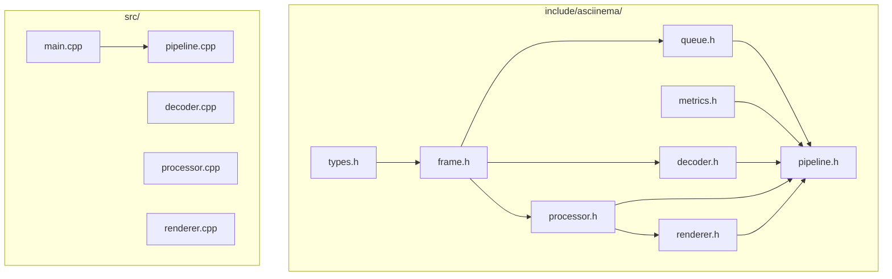

# Asciinema

A high-performance, multithreaded video-to-terminal renderer built in modern C++17. Decodes video files in real-time, processes frames through a concurrent pipeline, and renders them as ASCII art or true-color output directly in your terminal.


## Features

- **Real-time video playback** at original FPS
- **Two rendering modes**: ASCII characters or 24-bit true color
- **3-thread concurrent pipeline** with lock-free frame passing
- **Configurable backpressure**: choose between frame dropping or blocking
- **Live performance metrics**: FPS, latency percentiles (p50/p95), queue depth
- **Graceful degradation**: automatic frame dropping under load

## Architecture



### Concurrency Model



### Thread Synchronization



### Flow Control Strategies

| Strategy | Flag | Behavior | Trade-off |
|----------|------|----------|-----------|
| **Frame Dropping** | default | `try_push()` returns immediately | Smooth playback, may skip frames |
| **Backpressure** | `-bp` | `push()` blocks until space | No frame loss, may slow down |

## Tech Stack

- **C++17** — structured bindings, `std::optional`, `if constexpr`
- **OpenCV 4.x** — video decoding, image processing
- **ncurses** — terminal UI, flicker-free rendering
- **POSIX Threads** — `std::thread`, `std::mutex`, `std::condition_variable`

## Building

### Prerequisites

```bash
# macOS
brew install cmake opencv ncurses

# Ubuntu/Debian
sudo apt install build-essential cmake libopencv-dev libncurses5-dev
```

### Compile

```bash
make build          # Standard build
make release        # Optimized build (-O3)
make debug          # Debug symbols
```

## Usage

```bash
./build/asciinema-player [OPTIONS] <video_file>
```

### Options

| Flag | Description |
|------|-------------|
| `-color` | Enable 24-bit true color rendering |
| `-bp` | Enable backpressure (block when queue full) |
| `-help` | Show usage information |

### Examples

```bash
# ASCII mode (works on any terminal)
make run VIDEO=video.mp4

# True color mode (requires modern terminal)
make run VIDEO=video.mp4 COLOR=1

# Backpressure mode (no frame drops)
make run VIDEO=video.mp4 COLOR=1 BP=1
```

## Performance Metrics

The stats bar displays real-time performance data:

```
FPS D:30 P:30 R:30 | Lat 8.2/12.5ms | Drop 0 | Frames 1847 | Q:4/16 | DROP
```



## Project Structure



```
terminal-vision/
├── include/asciinema/
│   ├── types.h         # Core types, time utilities
│   ├── frame.h         # RawFrame, ProcessedFrame
│   ├── decoder.h       # VideoDecoder (OpenCV wrapper)
│   ├── processor.h     # FrameProcessor (image → chars)
│   ├── renderer.h      # TerminalRenderer (ncurses)
│   ├── queue.h         # BoundedQueue<T> (thread-safe)
│   ├── pipeline.h      # Pipeline orchestrator
│   └── metrics.h       # FPS counter, latency tracker
├── src/
│   ├── main.cpp        # Entry point, CLI parsing
│   ├── decoder.cpp
│   ├── processor.cpp
│   ├── renderer.cpp
│   └── pipeline.cpp
├── CMakeLists.txt
├── Makefile
└── README.md
```

## Key Implementation Details

### Thread-Safe Bounded Queue

```cpp
template <typename T>
class BoundedQueue {
    std::queue<T> queue_;
    std::mutex mutex_;
    std::condition_variable not_empty_, not_full_;
    
    void push(T item) {
        std::unique_lock lock(mutex_);
        not_full_.wait(lock, [&] { return queue_.size() < capacity_; });
        queue_.push(std::move(item));
        not_empty_.notify_one();
    }
};
```

### Move Semantics for Zero-Copy Frame Transfer

```cpp
RawFrame(FrameId id, TimePoint ts, cv::Mat img)
    : id(id), timestamp(ts), image(std::move(img)) {}
```

### Latency Tracking with Percentiles

```cpp
double p95() const {
    std::vector<double> sorted(samples_.begin(), samples_.end());
    std::sort(sorted.begin(), sorted.end());
    return sorted[sorted.size() * 95 / 100];
}
```

## What I Learned

- **Concurrent programming**: mutexes, condition variables, atomics
- **Producer-consumer patterns**: bounded queues, backpressure strategies
- **Modern C++17**: move semantics, RAII, `std::optional`, type aliases
- **Real-time systems**: frame timing, latency measurement, graceful degradation
- **Terminal graphics**: ANSI escape codes, ncurses double-buffering

## License

MIT License
